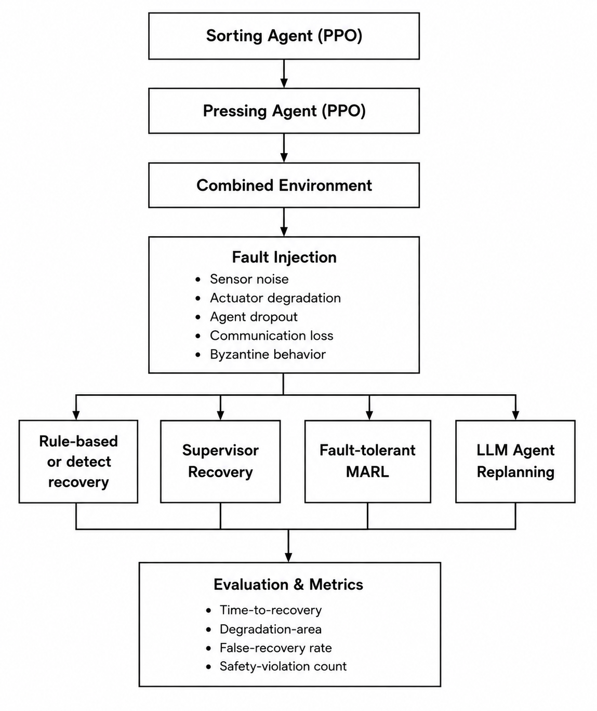

# FaultBench-Industrial. A Benchmark for fault recovery mechanisms in Multi Agent Reinforcement Learning Industrial Systems

A benchmark for evaluating **self-healing and fault-recovery mechanisms
in multi-agent industrial control systems**.

The project builds a common fault-injection and evaluation environment
around a modular industrial MARL system, then compares different
recovery paradigms under the same fault conditions.

> **Research question:** Under a standardized industrial fault-injection
> suite, how do rule-based reconfiguration, fault-tolerant-trained MARL,
> hierarchical supervision, and LLM-based replanning compare in recovery
> performance, degradation, false recovery, and safety?

## Overview

The system models a multi-stage industrial process consisting of:

-   a **Sorting agent**
-   a **Pressing agent**
-   a combined environment in which the agents operate together

The benchmark deliberately injects failures into this system and
evaluates how different recovery mechanisms respond.

The current fault suite contains five fault classes:

<table>
  <thead>
    <tr>
      <th>Fault</th>
      <th>Description</th>
    </tr>
  </thead>
  <tbody>
    <tr>
      <td><code>sensor_noise</code></td>
      <td>Corrupts observations with noise</td>
    </tr>
    <tr>
      <td><code>actuator_degradation</code></td>
      <td>Restricts or alters available actions</td>
    </tr>
    <tr>
      <td><code>agent_dropout</code></td>
      <td>Removes an agent's participation and applies its configured failsafe behavior</td>
    </tr>
    <tr>
      <td><code>comms_loss</code></td>
      <td>Drops communication/messages from an affected agent</td>
    </tr>
    <tr>
      <td><code>byzantine</code></td>
      <td>Replaces an agent's normal behavior with an adversarial policy</td>
    </tr>
  </tbody>
</table>

Each fault can be configured as either **permanent** or **transient**.
Fault injection occurs within a configurable random onset window,
currently `40–60` steps by default.

## Recovery Mechanisms

The benchmark compares four recovery paradigms plus a no-recovery
baseline.

### 1. Rule-based reconfiguration

A fixed heuristic determines the appropriate intervention after a fault.

This is the **oracle rule-based baseline**: it has access to the
ground-truth fault context rather than having to detect the fault from
observations.

### 2. Rule-based detection + reconfiguration

The system must first infer that a fault has occurred from observable
signals and then apply the rule-based recovery logic.

This separates **fault detection** from the recovery mechanism itself.

### 3. Fault-tolerant-trained MARL

The MARL policies are trained with faults injected during training using
a domain-randomization approach.

Recovery is therefore embedded in the learned policy rather than applied
as an explicit evaluation-time recovery hook.

### 4. Hierarchical supervisor agent

A separate learned supervisor monitors the modular agents and selects
interventions when recovery is required.

The supervisor operates over the existing Sorting + Pressing pair rather
than replacing their policies.

### 5. LLM-agent replanning

An LLM receives structured system state and generates a recovery plan
through the environment's control interface.

The implementation uses an API-based LLM and records decision latency,
errors, and fallback behavior.

## Architecture

At a high level:




## Installation

Create and activate the project environment, then install the project's
Python dependencies.

For example:

``` bash
git clone <repository-url>
cd MARL-Env-FI-and-recovery

python -m venv .venv
source .venv/bin/activate

pip install -r requirements.txt
```

If using the existing Conda/Mamba environment, activate that environment
instead.

## Running the Main Program

The main experiment driver is `main.py`.

``` bash
python main.py
```

It first asks whether to **train** or **test**.

### Training

Select:

``` text
Train or Test? (train/test): train
```

Then select one of:

``` text
vanilla
fault_tolerant
supervisor
```

#### Vanilla modular MARL

Trains the Sorting agent and then the Pressing agent using PPO without
action masking.

``` text
Train which variant? (vanilla/fault_tolerant/supervisor) [vanilla]: vanilla
```

#### Fault-tolerant MARL

Trains the modular policies with fault injection/domain randomization.

``` text
Train which variant? (vanilla/fault_tolerant/supervisor) [vanilla]: fault_tolerant
```

#### Supervisor

Trains the hierarchical supervisor over the vanilla modular agents.

``` text
Train which variant? (vanilla/fault_tolerant/supervisor) [vanilla]: supervisor
```

The main configuration currently uses:

``` text
Modular training:       10,000,000 timesteps
Supervisor training:     5,000,000 timesteps
Training episode length:       200 steps
Evaluation episode length:     200 steps
Default seed:                    42
```

## Running an Evaluation

Select:

``` text
Train or Test? (train/test): test
```

Choose a fault:

``` text
none
sensor_noise
actuator_degradation
agent_dropout
comms_loss
byzantine
```

For an injected fault, select:

``` text
transient
```

or:

``` text
permanent
```

For a transient fault, the duration can be supplied as either:

``` text
20
```

or as a sampled range:

``` text
10-30
```

Then select the recovery mechanism:

``` text
none
rule_based
rule_based_detect
fault_tolerant_marl
supervisor
llm_replanning
```

For example:

``` text
Train or Test? (train/test): test
Inject which fault? ...: sensor_noise
Transient or Permanent fault? ...: transient
Duration ...: 20
Apply which recovery mechanism? ...: supervisor
```

## Fault Configuration

The default fault configuration is defined in `main.py`.

``` python
DEFAULT_FAULT_CONFIG = {
    "injection_step_range": (40, 60),
    "duration": None,
    "duration_range": None,
    "target": "both",
    "seed": 123,

    "noise_std": 0.1,

    "mode": "stuck",
    "stuck_press_action": 0,
    "stuck_sort_mode": None,
    "restrict_sort_mode": 1,
    "restrict_press_id": 2,
    "degradation_prob": 0.3,

    "dropout_sort_mode": 0,
    "dropout_press_action": 0,

    "comms_mode": "blackout",

    "byzantine_mode": "worst_action",
}
```

A permanent fault is represented by:

``` text
duration = None
duration_range = None
```

A transient fault can use a fixed duration or a per-episode sampled
duration range.

## Evaluation Metrics

The benchmark does not rely solely on total episode reward.

For every fault-injected run, the evaluation harness records:

### Time-to-recovery

Number of steps/seconds between fault onset and restoration of the
required performance level.

### Degradation area

The integral of performance loss over the recovery period.

This captures not only **how quickly** the system recovers, but also
**how badly it performs while recovering**.

### False-recovery rate

How often a recovery mechanism initiates recovery when no actual fault
exists.

### Safety-violation count

Number of hard safety or operational constraint violations during the
recovery process.

The metrics are saved to:

``` text
log/recovery_metrics.jsonl
```

This allows the same metrics to be compared across the entire:

``` text
recovery mechanism × fault type × fault duration
```

matrix.

## Experimental Matrix

The intended benchmark compares:

``` text
5 fault types
×
2 fault durations
×
5 recovery conditions
```

where the recovery conditions are:

1.  no recovery
2.  rule-based
3.  rule-based + detection
4.  fault-tolerant MARL
5.  supervisor
6.  LLM replanning

The `none` condition is the baseline and is evaluated using the same
fault-injection environment.

The resulting matrix is used to answer whether:

-   one recovery paradigm dominates overall;
-   the best recovery method depends on fault type;
-   recovery speed trades off against safety;
-   learned, heuristic, and LLM-based approaches exhibit different
    failure modes.

## LLM Replanning

The LLM recovery mode requires an OpenAI API key.

Set it in the environment:

``` bash
export OPENAI_API_KEY="your-key"
```


The implementation records, for each LLM decision:

-   decision step
-   selected recovery action
-   relevant system state
-   latency
-   whether the call produced an error/fallback

LLM failures fall back to the configured safe/pass-through behavior
rather than terminating the entire experiment.

## Reproducibility

Experiments expose explicit seeds and fault-injection configuration.

The current main configuration uses:

``` text
SEED = 42
```

and faults are injected within:

``` text
40–60 steps
```

The verification harness should be run before reporting experimental
results.

``` bash
python verify_workings.py
```

A successful verification should report:

``` text
RESULT: no hard failures.
```

Warnings should be manually investigated rather than automatically
treated as implementation failures.

## Research Scope

The project is intended as a controlled benchmark rather than a proposal
that one particular recovery technology is inherently superior.

The central comparison is between:

``` text
Reactive heuristics
        vs.
Fault-tolerant learned policies
        vs.
Hierarchical learned intervention
        vs.
LLM-based dynamic replanning
```

The research proposal identifies three secondary questions:

-   Does a single recovery paradigm dominate across all fault classes?
-   Is there a recovery-speed versus safety trade-off?
-   How does recovery overhead scale as simultaneous faults increase?

fileciteturn0file1L9-L14

The broader intended contribution is a reusable fault-injection
benchmark and an empirical comparison of recovery mechanisms on a common
industrial-flavored MARL testbed. fileciteturn0file1L17-L27

## Results

The final experimental analysis should report results across multiple
seeds and preferably include confidence intervals and effect sizes.

Recommended primary result tables:

### Overall recovery comparison

``` text
Mechanism × Metric
```

### Fault-specific comparison

``` text
Fault × Mechanism × Metric
```

### Duration comparison

``` text
Permanent vs. Transient
```

### Trade-off analysis

``` text
Recovery speed vs. degradation area
Recovery speed vs. safety violations
```

The research proposal recommends multiple random seeds rather than
relying on single-run results.

## Research Goal

The ultimate goal is to provide an empirical answer to:

> **When a multi-agent industrial control system breaks, which recovery
> strategy should be used for which type of fault?**

Rather than evaluating one recovery method in isolation, this project
creates a common "crash-test laboratory" in which different self-healing
strategies can be evaluated under identical fault conditions.

## Acknowledgement

This project is built upon the **MARL-SortingEnv** benchmark developed by Maus, Atamna, and Glasmachers. The original environment provides a multi-agent reinforcement learning benchmark for sequential industrial control, combining sorting and pressing operations to study modular versus monolithic control architectures.

The present project extends this baseline by introducing **fault injection and recovery mechanisms** for evaluating the resilience of multi-agent industrial control systems under different failure conditions.

### Original Work

**Paper:**  
Tom Maus, Asma Atamna and Tobias Glasmachers (2025). [*Balancing Specialization and Centralization: A Multi-Agent Reinforcement Learning Benchmark for Sequential Industrial Control.* ](https://arxiv.org/pdf/2510.20408)

**Original Repository:**  
[Storm-131/MARL-SortingEnv](https://github.com/Storm-131/MARL-SortingEnv)

The original repository is licensed under the MIT License. :contentReference[oaicite:2]{index=2}

------------------------------------------------------------------------
